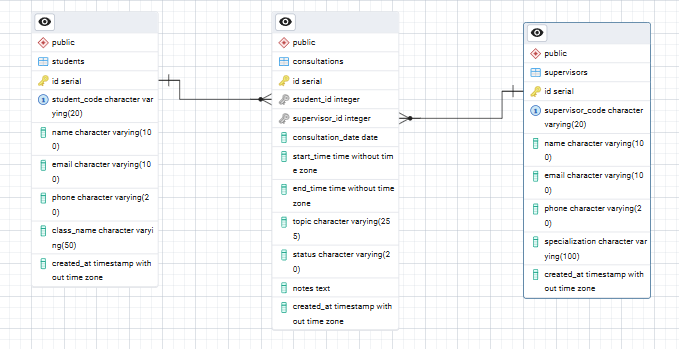
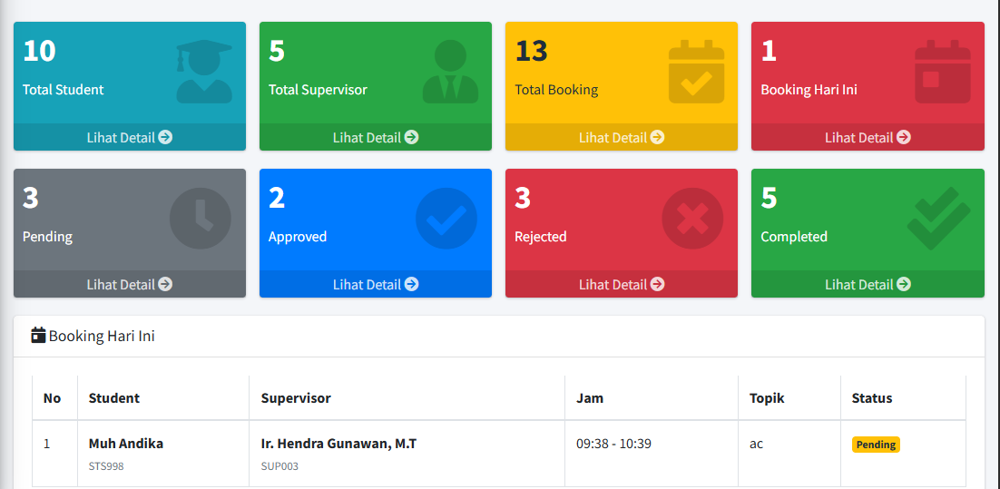
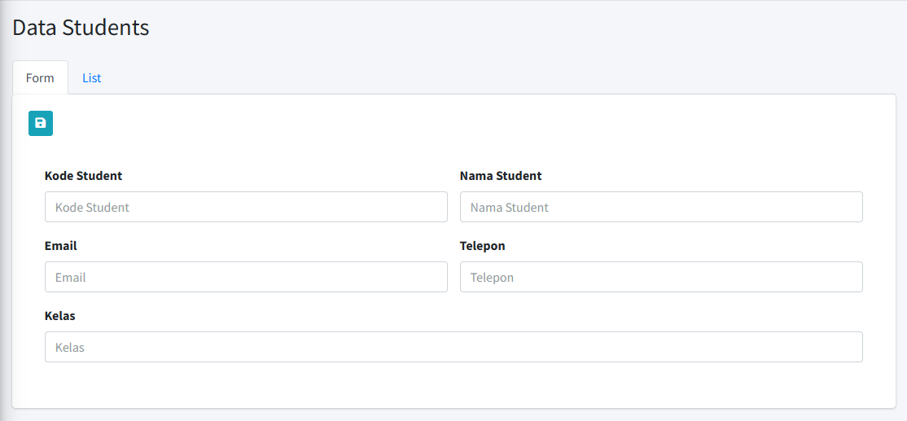
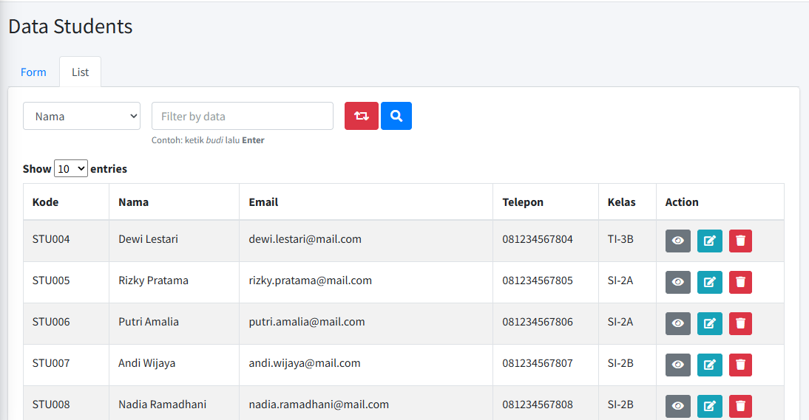
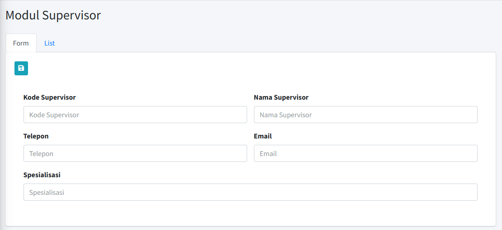
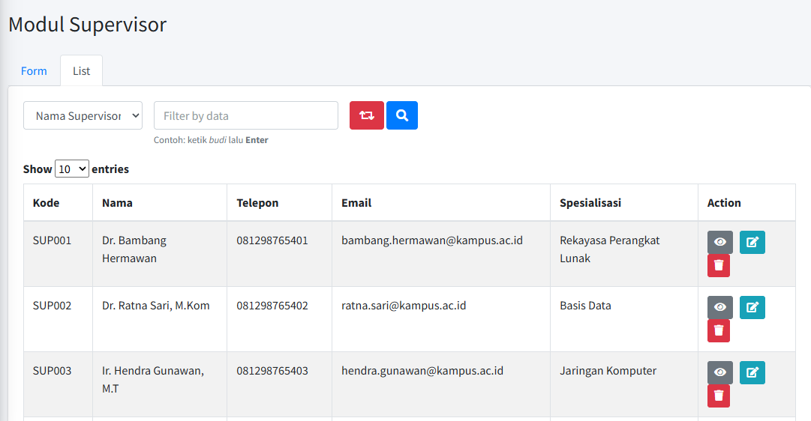
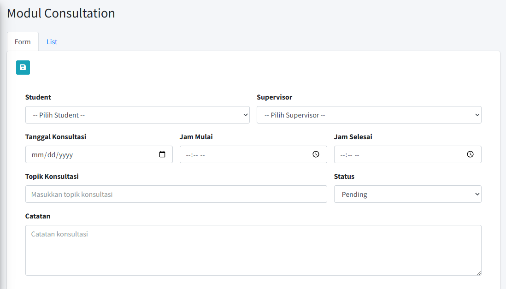
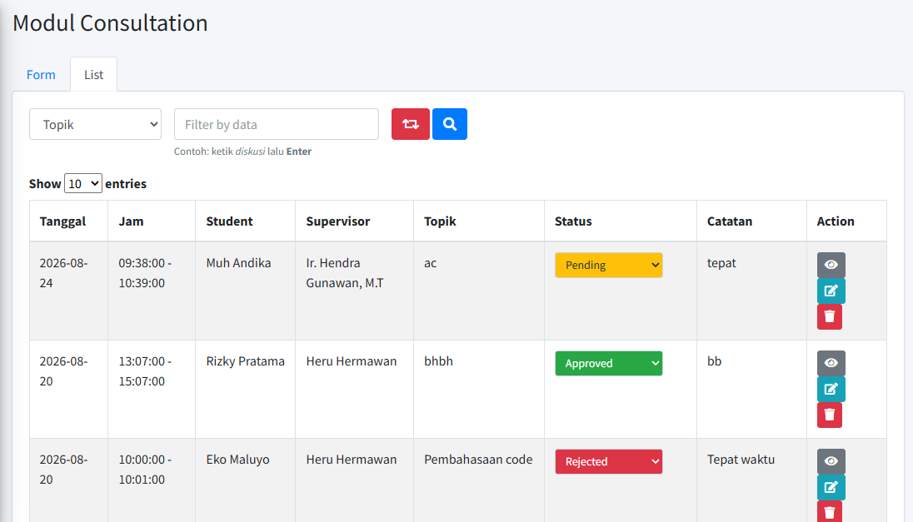
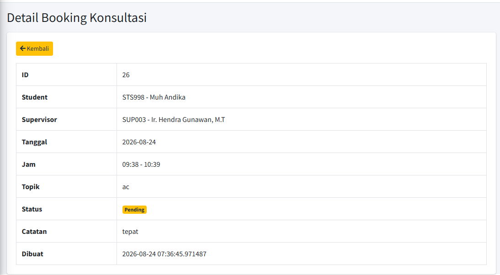

# Sistem Booking Jadwal Konsultasi/Bimbingan

Aplikasi sederhana untuk mengelola jadwal konsultasi/bimbingan antara **student**
(mahasiswa/peserta) dan **supervisor** (pembimbing), lengkap dengan validasi
bentrok jadwal. Dibuat sebagai penugasan magang individu.

## 1. Deskripsi Project
Sistem memungkinkan pengguna untuk:
- Mengelola data student (CRUD).
- Mengelola data supervisor (CRUD).
- Membuat booking jadwal konsultasi antara student & supervisor.
- Melihat daftar & detail booking.
- Mengubah status booking (Pending, Approved, Rejected, Completed) tanpa reload halaman.
- Mencegah bentrok jadwal, baik dari sisi supervisor maupun student.

## 2. Teknologi
| Komponen        | Teknologi |
|------------------|-----------|
| Backend          | PHP CodeIgniter 3 |
| Database         | PostgreSQL |
| Frontend         | Bootstrap 5, JavaScript / jQuery |
| Arsitektur       | MVC (backend) & MVVM sederhana (frontend) |
| Notifikasi UI    | SweetAlert2 |

## 3. Architecture
**Backend — MVC**
```
Model → Controller → View
Contoh: Consultation_model.php → Consultations.php → consultationsView.php
```

**Frontend — MVVM sederhana**
```
View (HTML di *View.php)  ↔  ViewModel (assets/js/*.js)  ↔  Data (AJAX ke Controller)
```
File JS di `assets/js/` berperan sebagai ViewModel: mengambil data lewat AJAX,
menyimpan state di JavaScript, lalu memperbarui tampilan (render tabel, badge
status, pesan bentrok jadwal) tanpa reload halaman. Contoh interaksi MVVM yang
diimplementasikan:
- Search student/supervisor/booking secara real-time.
- Dropdown supervisor & student yang dinamis di form booking.
- Preview/peringatan bentrok jadwal langsung saat mengisi form (sebelum submit).
- Validasi form di sisi client.
- Update status booking langsung dari dropdown di tabel, tanpa reload.

## 4. Struktur Folder Utama
```
application/
├── controllers/
│   ├── Dashboard.php
│   ├── Students.php
│   ├── Supervisors.php
│   └── Consultations.php
├── models/
│   ├── Student_model.php
│   ├── Supervisor_model.php
│   └── Consultation_model.php
├── views/
│   ├── partials/header.php, footer.php
│   ├── dashboardView.php
│   ├── studentsView.php
│   ├── supervisorsView.php
│   ├── consultationsView.php
│   └── consultationsDetailView.php
└── config/
    └── database.php

assets/
├── css/style.css
└── js/app.js, students.js, supervisors.js, consultations.js

database/
└── booking_konsultasi.sql
```

## 5. Fitur
**A. Master Student**: list, tambah, edit, hapus, detail, pencarian.
**B. Master Supervisor**: list, tambah, edit, hapus, detail, pencarian.
**C. Booking Konsultasi**: pilih student & supervisor, tentukan tanggal & jam,
isi topik, simpan booking, lihat daftar & status booking, ubah status, hapus.

## 6. Validasi
1. **Data wajib**: student, supervisor, tanggal, jam mulai, jam selesai, dan
   topik wajib diisi (dicek di client & server).
2. **Jam konsultasi**: jam mulai harus lebih kecil dari jam selesai.
3. **Bentrok jadwal supervisor**: supervisor tidak boleh punya 2 jadwal yang
   waktunya beririsan.
4. **Bentrok jadwal student**: student tidak boleh punya 2 jadwal yang
   waktunya beririsan, walau supervisor-nya berbeda.
5. **Status booking**: hanya boleh `Pending`, `Approved`, `Rejected`, `Completed`
   (divalidasi di database lewat `CHECK constraint` dan di controller).

Logika pengecekan bentrok ada di `Consultation_model.php` (method
`isSupervisorBusy()` dan `isStudentBusy()`), dipanggil dari `Consultations.php`
baik saat live-check (`checkConflict()`) maupun saat `save()`/`update()` supaya
validasi tidak bisa dilewati dari sisi client.

## 7. Database — 3 Tabel & Relasi
- **students** (1) — (N) **consultations** (N) — (1) **supervisors**
- 1 student bisa punya banyak booking konsultasi.
- 1 supervisor bisa membimbing banyak booking konsultasi.
- 1 booking konsultasi hanya terhubung ke 1 student dan 1 supervisor
  (foreign key `student_id`, `supervisor_id` di tabel `consultations`).



Script database lengkap ada di `database/booking_konsultasi.sql`.

## 8. Instalasi
1. **Clone / extract project** ke folder web server (misal `htdocs/booking-konsultasi`
   untuk XAMPP, atau folder web root lain yang sudah mendukung PHP + PostgreSQL).
2. **Buat database PostgreSQL**:
   ```
   psql -U postgres
   CREATE DATABASE booking_konsultasi;
   \c booking_konsultasi
   \i database/booking_konsultasi.sql
   ```
   (baris `CREATE DATABASE` di dalam file SQL sengaja dikomentari, jalankan
   secara terpisah seperti contoh di atas)
3. **Atur koneksi database** di `application/config/database.php`:
   sesuaikan `username`, `password`, `hostname` sesuai PostgreSQL kamu.
4. **Atur base URL** di `application/config/config.php`:
   ```php
   $config['base_url'] = 'http://localhost/booking-konsultasi/';
   ```
5. Pastikan ekstensi PHP `pgsql` / `pdo_pgsql` aktif di `php.ini`.
6. Jalankan lewat browser: `http://localhost/booking-konsultasi/`
   (otomatis diarahkan ke Dashboard).

## 9. Screenshot Aplikasi

**Dashboard**


**Master Student — Form**


**Master Student — List**


**Master Supervisor — Form**


**Master Supervisor — List**


**Booking Konsultasi — Form**


**Booking Konsultasi — List**


**Detail Booking**


## 10. Catatan
Sesuai batasan project, sistem ini **tidak** menyertakan: login/authentication,
role & permission, REST API, Vue/React, Docker, Redis, WebSocket, notifikasi
WhatsApp/email, upload dokumen, video conference, integrasi Google Calendar,
multi-company, atau approval bertingkat.